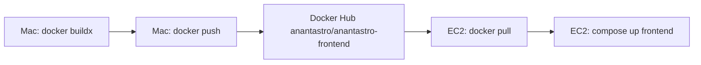

# Frontend: build locally, push to Docker Hub, pull on server

The production EC2 instance (`18.215.189.57`) has **2 vCPUs and ~1 GB RAM**. A Next.js Docker build there takes ~50 minutes. Build on your Mac, **push to Docker Hub**, and **pull on the server**.

## Overview



| Step | Where | Time (typical) |
|------|-------|----------------|
| `docker buildx build --push` | Mac | 3–10 min |
| `docker compose pull` | EC2 | 30–90 sec |
| `docker compose up` | EC2 | ~30 sec |

**Registry image:** `anantastro/anantastro-frontend:<tag>`

---

## Prerequisites

### On your Mac

- [Docker Desktop](https://docs.docker.com/desktop/) installed and **running**
- App repo: `/Users/leevesh/Workspace/Anantastro/app`
- SSH key: `/Users/leevesh/keys/anant.pem`
- Docker Hub account: `anantastro`

### One-time: deploy credentials

Copy the example file and add your Docker Hub PAT:

```bash
cd /Users/leevesh/Workspace/Anantastro/app
cp .env.deploy.example .env.deploy
```

Edit `.env.deploy`:

```env
DOCKER_USERNAME=anantastro
DOCKER_TOKEN=dckr_pat_xxxxxxxx
DOCKER_REGISTRY=anantastro/anantastro-frontend
DOCKER_TAG=latest
```

`.env.deploy` is gitignored — never commit it.

The deploy script logs in automatically on your Mac and on the server before push/pull.

### On the server (one-time)

`~/docker-compose.yml` should reference the registry image only (no `build:` block):

```yaml
  frontend:
    image: anantastro/anantastro-frontend:latest
```

Optional in `~/.env`:

```env
FRONTEND_IMAGE=anantastro/anantastro-frontend:latest
```

Docker Hub login is handled by `./scripts/deploy-frontend.sh` on each deploy. To log in manually:

```bash
ssh -i /Users/leevesh/keys/anant.pem ubuntu@18.215.189.57
docker login -u anantastro
```

---

## Build-time API URL

`NEXT_PUBLIC_API_URL` is **baked into the Next.js bundle at build time**.

| Deploy target | `NEXT_PUBLIC_API_URL` |
|---------------|------------------------|
| Production (nginx on `test.anantastro.com` proxies `/api`) | **empty** `""` |
| Local container test against prod API | `https://test.anantastro.com` |
| Local dev (no Docker) | see `.env.development` |

Production nginx routes `/api` to the backend, so the frontend should use **relative URLs** (empty `NEXT_PUBLIC_API_URL`).

---

## Step-by-step: manual deploy

All commands from the app repo unless noted.

### 1. Enable cross-platform builds (one-time)

```bash
cd /Users/leevesh/Workspace/Anantastro/app

docker buildx create --name anantastro --use 2>/dev/null || docker buildx use anantastro
docker buildx inspect --bootstrap
```

### 2. Build and push for EC2 (linux/amd64)

```bash
source .env.deploy
export NEXT_PUBLIC_API_URL=""   # production: same-domain nginx proxy

docker buildx build \
  --platform linux/amd64 \
  --push \
  -t "${DOCKER_REGISTRY}:${DOCKER_TAG}" \
  --build-arg NEXT_PUBLIC_API_URL="${NEXT_PUBLIC_API_URL}" \
  -f Dockerfile \
  .
```

### 3. Pull and restart on the server

```bash
ssh -i /Users/leevesh/keys/anant.pem ubuntu@18.215.189.57 <<'EOF'
set -euo pipefail
cd ~
docker compose pull frontend
FRONTEND_IMAGE=anantastro/anantastro-frontend:latest docker compose up -d frontend --no-build --force-recreate
docker compose ps frontend
EOF
```

---

## Automated deploy

```bash
cd /Users/leevesh/Workspace/Anantastro/app

# Build, push, pull on server, restart (tag: latest)
./scripts/deploy-frontend.sh

# Deploy a specific tag
DOCKER_TAG=v1.2.3 ./scripts/deploy-frontend.sh

# Build and push only (no server restart)
./scripts/deploy-frontend.sh --no-deploy

# Push an already-built local image and deploy
./scripts/deploy-frontend.sh --skip-build
```

Environment (from `.env.deploy` or export):

| Variable | Default |
|----------|---------|
| `DOCKER_USERNAME` | `anantastro` |
| `DOCKER_TOKEN` | *(required)* |
| `DOCKER_REGISTRY` | `anantastro/anantastro-frontend` |
| `DOCKER_TAG` | `latest` |
| `DOCKER_IMAGE` | `${DOCKER_REGISTRY}:${DOCKER_TAG}` |
| `SSH_KEY` | `/Users/leevesh/keys/anant.pem` |
| `SSH_HOST` | `18.215.189.57` |
| `NEXT_PUBLIC_API_URL` | `""` (empty) |

Example with git commit as tag:

```bash
DOCKER_TAG=$(git rev-parse --short HEAD) ./scripts/deploy-frontend.sh
```

---

## Troubleshooting

### `denied: requested access to the resource is denied`

Check `DOCKER_TOKEN` in `.env.deploy`. The deploy script runs `docker login` on Mac and server automatically.

### `exec format error` on the server

Image built for wrong architecture. Rebuild with `--platform linux/amd64`.

### Server pulls old image

```bash
ssh -i /Users/leevesh/keys/anant.pem ubuntu@18.215.189.57 \
  "docker compose pull frontend && FRONTEND_IMAGE=anantastro/anantastro-frontend:latest docker compose up -d frontend --no-build --force-recreate"
```

Or push with an explicit version tag instead of only `latest`.

### Frontend still rebuilding on server

Remove any `build:` block under `frontend` in `~/docker-compose.yml`. Only `image:` should remain.

### Local compose build (optional)

To build the frontend in Docker locally instead of pulling:

```bash
docker compose -f docker-compose.yml -f docker-compose.frontend-build.yml up -d --build frontend
```
